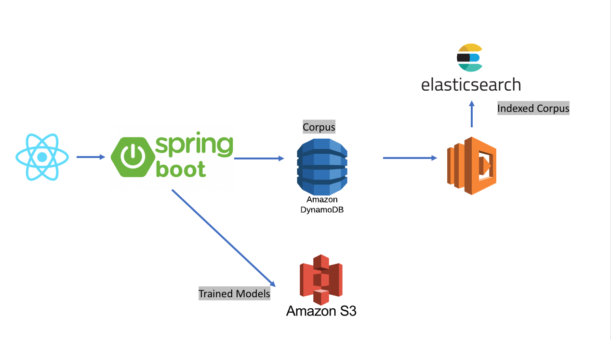

# Sesame Lab
Sesame Lab is an Natural Language Processing training website that allows users to collaborate 
over the web to tag documents for the purpose of training NLP algorithms

The server uses [OpenNLP](https://opennlp.apache.org/) as the backing algorithm provider. I may
consider using alternate providers or even entirely different language stacks (ex: NTLK) in the future

The central idea behind Sesame Lab is that tagging and cleaning corpus is the most arduous part of
NLP based model building. There are many domain specific concepts that the standard models don't cover.
For example: in the financial domain, issuer names, mutual fund families are often prominently featured
in textual data

# Architecture
A SPA (Single Page Application) written in React provide end user access. The Application Server
is written in Kotlin on Spring Boot 2.0.0

This separation of UI and Server enables a coherent access model between browser based and machine-to-machine
API calls

Training data (the corpus of documents) are stored in DynamoDB (could've used MongoDB or any Key Value store).
To keep the data searchable and answer inquiries such as "How many documents are in each  topic" we replicate
all corpus data to a search cluster (currently Elasticsearch)

The synchronization between DynamoDB and Elasticsearch is achieved using an Lambda, 
source code located [Here](https://github.com/erfangc/dynamodb-elasticsearch-replicator)

See architectural diagram below 
 

# The User Interface
I use TypeScript & React to create web based UIs, the UI is separately hosted [Here](https://github.com/erfangc/sesame-lab-ui)
Using TypeScript increases productivity drastically as many IDEs / popular editors support inspection / autocomplete
and compile time syntax checks

React is a great framework to build SPAs (Single Page Applications)

Deploying our UI separately from our API server decouples the two and clears up the story for future API access

In this case the SPA UI acts as a OAuth 2.0 client and this server acts as a Resource Server 

# Authentication & Authorization
This application is OIDC (OpenID Connect) compliant and uses OAuth 2.0 to authorize end users / APIs
to access its contents

I use [Auth0](https://auth0.com/) as the Authentication Service Provider. Access to the Spring Boot
server is only possible via a valid JWT token issued and signed by the proper Auth0 domain with 
this server being an entry in the `aud` claim. This is true for both human users accessing the application
via the React SPA as well as machine users using an API

There are no other way to access the server (no direct LDAP/AD authentication over Basic or cookie/sessions)

If you are unfamiliar with OAuth and the different roles available in OAuth, please check out 
the spec [Here](https://tools.ietf.org/html/rfc6749#section-1.1)

# Data Layer
## DynamoDB
We use DynamoDB as an high performance key value document database. This is where we store the corpus that 
serve as the training data

## S3
We use S3 to store binary files representing the trained models. The reason we use S3 over DynamoDB is 
that the trained model should be portable (i.e. downloadable over a convenient URL) and/or readily
examinable

For our purpose S3 is basically also just a scalable key value store with the value being a Byte stream

## Elasticsearch
Every document in DynamoDB is sync-ed into a search cluster. Each field is indexed so we can provide
browsing / navigation and free-form text search capabilities on top of our corpus

This reduces the read burden on DynamoDB by reducing/eliminating scan queries and throughput requirements
on GIS (Global Secondary Indices)

## Postgres / Traditional RDMS
We through in Postgres database to store optional metadata. These are expected to be infrequently accessed
We could easily replace this with another DynamoDB table  